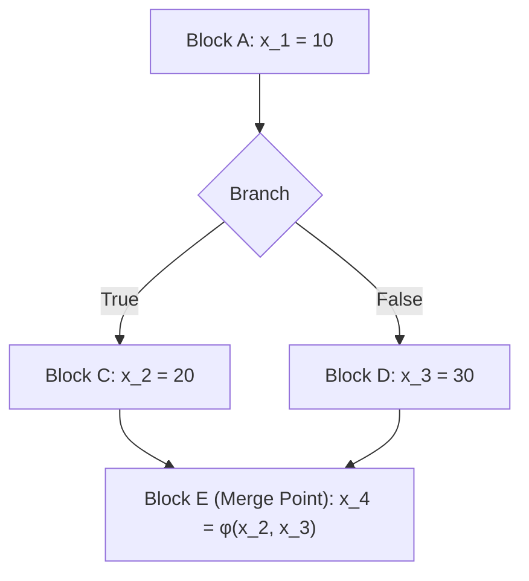
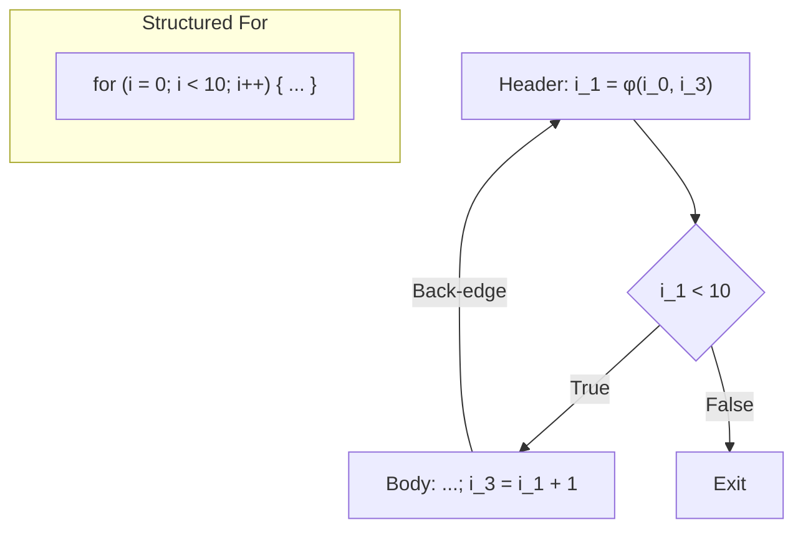
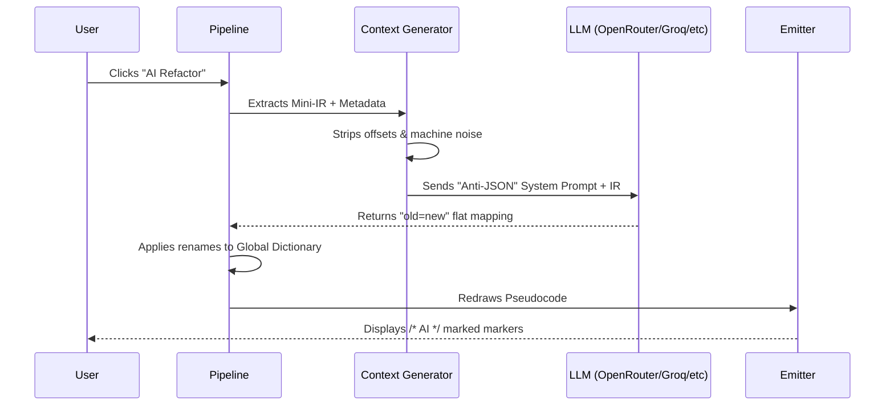

  

# EUVA Decompiler Overview

The EUVA Decompiler is a high-performance binary analysis engine designed to bridge the **semantic gap** between raw machine-level instruction sets and human-readable high-level abstractions. 

## 1. The Necessity of Decompilation

Modern binaries are a lossy representation of original source code. Optimization passes, register allocation, and the flat nature of Von Neumann architecture strip away variable names, types, and control structures. 

> [!NOTE]
> The primary objective of the EUVA decompiler is to reconstruct the original **Program Intent** by reversing these transformations through a rigorous mathematical and logical pipeline.

Without a decompiler, a reverse engineer must manually track the state of a finite machine registers, flags, stack across billions of possible execution paths. EUVA automates this by lifting the machine state into a theoretical model where data-flow and control-flow are explicitly defined and simplified.

---

## 2. Under the Hood: The Decompilation Pipeline

The engine operates as a sequential transformation pipeline where each stage increases the abstraction level of the Intermediate Representation.

### 2.1 Library Function Identification
Before any heavyweight lifting begins, the engine attempts to **short-circuit** known library functions, saving CPU time on code that does not require full decompilation.

#### Level 5A CRC32 Hash Matching
The first 32 bytes of the function's entry block are decoded with Iced and **position-normalized**: all relative call/jump displacement bytes, RIP-relative offsets, and (for 32-bit) absolute memory displacements are zeroed out. The resulting buffer is hashed with CRC32 (`FunctionHasher.GetNormalizedCrc32`). If a match is found in `SignatureCache.FunctionHashesLookup`, the function is immediately tagged as a library function and only receives a single optimization pass.

#### Level 5B Fingerprint Radar
If CRC32 does not match, a full **IR-level fingerprint** is extracted *after* the SSA optimization loop (on clean IR identical to what the Harvester sees). The fingerprint vector includes:
*   **Topological features**: block count, edge count, cyclomatic complexity, back-edge count, max depth.
*   **Instruction features**: totals, calls (direct/indirect), memory reads/writes, compares, arithmetic, bitwise.
*   **Magic constants**: immediate values collected via Jaccard set-similarity (filtering small values, powers of two, and likely VA addresses).
*   **Block-size sequence**: a DFS-order list of live instruction counts per block, compared via Fuzzy Levenshtein.

The fingerprint is compared against the `FingerprintIndex` database using a weighted scoring model (topology 35%, instructions 35%, constants 20%, block-signature 10%). Matches above the **High threshold** (85%) rename the function; **Medium** (70%) and **Low** (55%) matches are annotated via `UserComments` only.

### 2.2 Instruction Lifting & ISA Normalization
Raw bytes are decoded using the Intel/AMD64 instruction set semantics. To eliminate hardware specific quirks e.g., implicit flag updates, complex addressing modes, every instruction is "lifted" into a hardware-agnostic IR.

A single x86 instruction like `add [rbx+rcx*4+0x10], eax` is literally decomposed into:
1. **Address Calculation**: $Addr = rbx + (rcx \times 4) + 0x10$
2. **Memory Load**: $Val_{tmp} = Load_{32}(Addr)$
3. **Arithmetic**: $Result = Val_{tmp} + eax$
4. **Memory Store**: $Store_{32}(Addr, Result)$
5. **Flag Update**: $(CF, ZF, SF, OF) = UpdateFlags(Result)$

### 2.3 Static Single Assignment Construction
To perform precise data-flow analysis, the IR is transformed into **SSA Form**. In this state, every variable is assigned exactly once, creating a clear mapping between definitions and uses.

#### Phi ($\phi$) Node Injection
When control-flow paths merge e.g., after an `if-else` block, a variable $v$ might have different versions depending on which path was taken ($v_1$ or $v_2$). To reconcile this, the engine injects a **Phi function**:
$$v_3 = \phi(v_1, v_2)$$

The placement of $\phi$ nodes is determined by calculating the **Dominance Frontier** $DF(n)$ for each node $n$ in the Control Flow Graph. If a node $d$ defines a variable $x$, then a $\phi$ node for $x$ must be inserted in every node in the iterated dominance frontier of $d$.



### 2.4 The Optimization Loop 
The IR undergoes an iterative optimization process, repeating up to 10 times (or 1 pass for identified library functions) or until a fixed point is reached (no further changes).

Each pass executes **five sub-passes** in order:
1.  **Constant Propagation**: If a variable $v = k$ where $k$ is a constant, all uses of $v$ are replaced by $k$.
2.  **Copy Propagation**: If $a = b$, all uses of $a$ are replaced by $b$, eliminating redundant assignments.
3.  **Expression Simplifier**: Algebraic and bitwise identity reductions are applied. For example: $x \oplus x \to 0$, $(x \times 2^n) \to (x \ll n)$, $x + 0 \to x$, $x \land \text{0xFF..F} \to x$, and $x \lor 0 \to x$.
4.  **Expression Inliner (AST Folding)**: A definition $v = expr$ is inlined into its consumer if $UseCount(v) = 1$ and the movement is **Memory Safe** (no intervening stores or calls). This works recursively on nested `Expression` operands and validates safety across blocks via the immediate dominator chain.
5.  **Dead Code Elimination**: If a definition $v = expr$ has zero uses and no side effects, it is excised.

### 2.5 Post-SSA Transformation Passes
After the main SSA loop finishes and liveness is computed, a second layer of **TransformationPasses** runs up to 5 iterations, performing higher-level optimizations:

*   **Dead Variable Elimination**: Uses a reference-counting scheme across SSA versions; definitions with zero use-count are killed iteratively
*   **Variable Merging**: Single-use `Assign` instructions where the source is a register, stack slot, or constant are eliminated by substituting the source into all consumers
*   **Expression Folding**: Single-use arithmetic/logic definitions are folded into their consumers as `Expression` operands, building nested AST trees directly inside the IR
*   **API Call Folding**: When an `Assign` or `Load` instruction feeds an immediately subsequent `Call` as its only consumer, the indirection is eliminated the `Call` directly references the API address.
*   **Pointer Analysis**: Memory operands with both a base register and a scaled index register are used to infer pointer-to-element types based on the scale factor ($1 \to u8^*$, $4 \to u32^*$, $8 \to u64^*$).
*   **Variable Coalescing**: A Union-Find algorithm groups SSA versions of the same base variable that flow through $\phi$-nodes or through `Assign`/`Add`/`Sub` chains, assigning them a single human-readable name e.g., `var_1`, `arg_1`.
*   **Variable Renaming**: ABI argument registers `RCX`, `RDX`, `R8`, `R9` at SSA version 0 receive `arg_N` names; all other coalesced groups receive `var_N`.

---

## 3. High-Level Semantic Recovery

### 3.1 Advanced Type Inference
The engine uses a **Worklist-based Constraint Solver** to propagate types across the SSA graph.

#### Constraint Propagation Rules
Types are deduced based on the semantics of IR opcodes:
*   **Width Matching**: $Add_{32}$ implies 32-bit integer types.
*   **Pointer Arithmetic**: If $p$ is a pointer and $i$ is an integer, then $p + (i \times scale)$ results in a pointer to a type of size $scale$.
*   **Bidirectional Flow**: Types flow forward from definitions to uses and backward from typed sinks e.g., function arguments to their sources.

$$T(dest) = \bigcup_{i} T(source_i) \cap T_{opcode}$$

> [!WARNING]
> Type unification at $\phi$ nodes strictly prioritizes specific types e.g., `struct Foo*` over generic types e.g., `void*`.

### 3.2 Struct & VTable Recovery
Two specialized passes reconstruct C++ object layouts from raw memory access patterns:

*   **StructReconstructor**: Scans all memory operands for `[base_reg + displacement]` patterns (excluding stack/frame/IP-relative accesses). When multiple accesses through the same base register use distinct fixed displacements, the engine clusters them into a `RecoveredStruct` with typed fields. If the base register is `RCX` or `RDI` (common `this` pointers), the struct is tagged as `this_type`.
*   **VTableDetector**: Identifies virtual function calls by recognizing the pattern `call [vtable_reg + offset]` where `vtable_reg` was loaded from `[obj_ptr + 0]`. Detected calls are annotated as `vfunc_N` and the object pointer is typed as `Class_vtable*`.

### 3.3 Control Flow Structuring
The flat CFG is transformed into a structured Abstract Syntax Tree (AST). The algorithm identifies topological patterns to recover block structures:

*   **Conditional Blocks**: Isolate regions where two paths diverge and later merge at a **Post-Dominator** node.
*   **Loop Recovery**: Identifies **Back-edges** $(n, h)$ where $h$ dominates $n$. 
    *   **While Loops**: Condition tested at the header.
    *   **Do-While Loops**: Condition tested at the tail (back-edge).
    *   **For Loops**: Recovered by matching a `While` loop with a preceding initializer and a trailing step-increment within the loop body.
*   **Switch Detection**: `SwitchDetector` identifies indirect jumps through scaled-index memory operands (`[table_base + idx * scale]`) guarded by an unsigned-compare bound-check on the predecessor block.



### 3.4 Idiom Recognition
After structuring, `IdiomRecognizer` scans the AST for common loop patterns and collapses them into high-level intrinsic calls:

*   **memset**: A `do-while` loop whose body stores a constant zero to a memory location with a pointer-counter condition is collapsed into `memset(ptr, 0, count)`.
*   **memcpy**: A `do-while` loop with a `Load → Store` body and two pointer increments is collapsed into `memcpy(dst, src, count)`.

### 3.5 Semantic Guessing
The `SemanticGuesser` assigns context-aware names *without* AI involvement, using two channels:

1.  **String/Regex Triggers**: When an instruction references a string literal via constant or memory displacement, `SignatureCache.GetNameForString` checks both exact `StringTriggers` and `RegexTriggers` tables. Matched names are written to `userRenames` keyed by stack slot, global address, or SSA register key.
2.  **API Signatures**: When a `Call` instruction targets a known import, its `ApiSignatures.ReturnName` is applied to the call's return destination.
3.  **API Chains** (`GuessChainNames`): All API calls within a function are collected into a set. If the set matches a defined chain in `SignatureCache.Db.ApiChains`, the function itself is renamed (e.g., a function calling `socket`, `connect`, `send` might be named `network_send_data`).

### 3.6 Calling Convention ABI Recovery
Registers and stack slots are mapped back to function parameters. The analyzer identifies "caller-saved" and "callee-saved" registers to determine which registers hold return values e.g., `rax` and which hold arguments e.g., `rcx`, `rdx`, `r8`, `r9` in x64 fastcall.

---

### 4. Glass Engine (C# Scripting Integration)
The standard data-flow and heuristic passes mentioned above operate universally. However, heavily obfuscated code, custom virtual machines, and anti-analysis tricks often require manual intervention. The **Glass Engine** exposes the EUVA Decompiler pipeline to external, runtime-compiled C# scripts, granting users total programmatic control over the IR, AST, and Type Systems without needing to recompile the decompiler itself.

#### 4.1 Theory & Pipeline Hooks
The Glass Engine conceptualizes the decompilation pipeline as a series of intercepted states. Scripts can hook into specific checkpoints defined by the `PassStage` enumeration:
* `PreSsa`: Intercept raw IR before variable versioning. Ideal for repairing deliberately broken Control Flow Graphs (e.g., bypassing `ExitProcess` anti-debug traps).
* `PostSsa`: Intercept clean, versioned IR. Ideal for custom pattern matching, such as resolving XOR-obfuscated constants or collapsing proprietary math operations.
* `PreTypeInference`: Intercept the graph before types are guessed. Ideal for injecting manual knowledge e.g., forcing a register to be recognized as a `_PEB*` pointer based on its address.
* `PostTypeInference`: Fix incorrectly guessed types.
* `PostStructuring`: Intercept the final AST to rewrite conditional logic or simplify complex boolean expressions before pseudocode emission.

#### 4.2 Under the Hood: High-Performance Delegates
To maintain extreme performance across binaries containing thousands of functions, the Glass Engine does **not** compile scripts on the fly for every function. 
Instead, it utilizes the Roslyn Compiler `Microsoft.CodeAnalysis.CSharp.Scripting` in a highly optimized manner:
1. **Application Startup `InitializeAsync`**: The `ScriptLoader` searches the application's `Scripts/` directory for `.cs` files.
2. **One-Time Compilation**: It reads each script and compiles the syntax tree into memory exactly **once** using `CSharpScript.Create<IDecompilerPass>(...).CreateDelegate()`. This converts the C# text into a native, executable function pointer (delegate).
3. **Per-Function Invocation `PrepareFunctionPassesAsync`**: When a new function is analyzed, the pre-compiled delegates are instantaneously invoked to spawn fresh instances of the user's `IDecompilerPass`. This eliminates syntax parsing overhead during analysis loops, allowing scripts to execute in microseconds.

#### 4.3 Usage Guide
To write a script, simply create a new `.cs` file in the `Scripts/` directory located next to the main EUVA executable. 
A script requires only two things:
1. It must implement the `IDecompilerPass` interface.
2. It must return a new instance of itself at the bottom of the file (as it is evaluated as a Roslyn script expression).

**Example: A Simple Log Pass**
```csharp
using System;
using EUVA.Core.Scripting;
using EUVA.Core.Disassembly.Analysis;

public class MyLoggerPass : IDecompilerPass
{
    // 1. Choose WHEN this script runs e.g., right after CFG creation, before SSA
    public PassStage Stage => PassStage.PreSsa;

    // 2. Implement the Execution logic
    public void Execute(DecompilerContext context)
    {
        // The context object gives you full access to the current function's IR blocks
        Console.WriteLine($"Analyzing function at 0x{context.FunctionAddress:X}");
        
        foreach (var block in context.Blocks)
        {
            foreach (var instr in block.Instructions)
            {
                // You can read, modify, or delete instructions here.
                if (instr.Opcode == IrOpcode.Xor) 
                {
                   // Do something custom...
                }
            }
        }
    }
}

// 3. Return the instance so the Glass Engine can load it
return new MyLoggerPass();
```
Upon saving this file to `Scripts/MyLoggerPass.cs` and launching EUVA, the ScriptLoader will automatically compile it, inject it into the `DecompilationPipeline`, and execute your logic every time a function is analyzed.


---

## 5. AI-Assisted Semantic Reconstruction

While the EUVA Core engine excels at recovering **Logic** control flow, data flow, types, it inherently cannot recover human intentions or variable semantics lost during compilation. The **AI Refactoring Assistant** bridges this gap by utilizing Large Language Models LLMs to transform generic symbols e.g., `v1`, `a1` into meaningful, context-aware names.

### 5.1 The Semantic Gap
Machine code lacks names. A decompiler can prove that `v1` is a `uint32_t` and acts as a loop counter, but only an LLM can infer that `v1` represents `retry_count` based on its proximity to network-related WinAPI calls and specific error constants.

### 5.2 Technical Pipeline
The AI integration follows a high-performance, strictly structured pipeline:



### 5.3 Context Enrichment (Mini-IR)
To keep token costs low and accuracy high, EUVA does not send raw pseudocode. Instead, `AiContextGenerator.cs` produces **Mini-IR**:
*   **Symbol Mapping**: Maps raw addresses to Imported Symbols e.g., `&printf` instead of `0x401000`.
*   **String Hints**: Injects referenced string literals directly into the logic flow.
*   **Type Hints**: Appends inferred types to operands so the AI understands data widths.
*   **Naming Standardization**: Uses `NamingConventions.cs` to ensure the AI and the decompiler use identical keys for variables, preventing "orphan" renames.

### 5.4 High-Performance Parsing
EUVA uses a custom "Anti-JSON" approach. Instead of expensive JSON serialization, we force the LLM to return simple `key=value` pairs. These are parsed in `AiResponseParser.cs` using `ReadOnlySpan<char>`, allowing for zero-allocation processing that doesn't trigger the Garbage Collector even on massive functions.

### 5.5 User Guide: Step-by-Step

#### Step 1: Configuration
1.  Open **Start Decompiler -> AI Settings**.
2.  **Base URL**: Use any OpenAI-compatible endpoint.
    *   *Examples*: `https://openrouter.ai/api/v1/chat/completions`, `http://localhost:11434/v1` (Ollama) and other providers.
3.  **API Key**: Your provider's key encrypted via DPAPI.
4.  **Model Name**: The technical name e.g., `gpt-4o`, `deepseek-ai/DeepSeek-V3`.

#### Step 2: Custom System Prompt
You can tune the personality of your AI agent.
*   *Default*: Focuses on standard C++ variable naming.
*   *Specialized*: Ask it to "use names consistent with Linux Kernel style" or "detect malware patterns and name variables accordingly."

#### Step 3: Refactoring & Review
1.  Click **AI Refactor** in the Decompiler toolbar.
2.  Wait for the response Progress indicated on the button.
3.  **Jump AI**: Use this button to cycle through every line changed by the AI.
4.  **/* AI */ Markers**: Look for variables highlighted in purple with an explicit AI comment.
5.  **Reject AI**: If the LLM hallucinated, one click restores the function to its original state.
6. **AI Explain**: AI Explain button, AI Explains compiled code, this button is available after AI refactoring

---

## 6. Repository Resource Mapping

The following links provide direct access to the implementation details of the components described above.

### Core Orchestration
* [DecompilationPipeline.cs](../EUVA.Core/Disassembly/Analysis/DecompilationPipeline.cs) - The main execution orchestrator and optimization loop.
* [IrLifter.cs](../EUVA.Core/Disassembly/Analysis/IrLifter.cs) - ISA-to-IR translation logic.

### Data-Flow & Optimization
* [SsaBuilder.cs](../EUVA.Core/Disassembly/Analysis/SsaBuilder.cs) - SSA form construction and Phi-node placement.
* [ConstantPropagation.cs](../EUVA.Core/Disassembly/Analysis/ConstantPropagation.cs) - Numerical constant folding.
* [CopyPropagation.cs](../EUVA.Core/Disassembly/Analysis/CopyPropagation.cs) - Redundant assignment elimination.
* [ExpressionSimplifier.cs](../EUVA.Core/Disassembly/Analysis/ExpressionSimplifier.cs) - Algebraic and bitwise identity reductions.
* [ExpressionInliner.cs](../EUVA.Core/Disassembly/Analysis/ExpressionInliner.cs) - AST folding and expression fusion.
* [DeadCodeElimination.cs](../EUVA.Core/Disassembly/Analysis/DeadCodeElimination.cs) - Redundant code excision.
* [TransformationPasses.cs](../EUVA.Core/Disassembly/Analysis/TransformationPasses.cs) - Post-SSA variable merging, coalescing, expression folding, and renaming.

### Analysis & Inference
* [TypeInference.cs](../EUVA.Core/Disassembly/Analysis/TypeInference.cs) - The constraint-based type solver.
* [CallingConventionAnalyzer.cs](../EUVA.Core/Disassembly/Analysis/CallingConventionAnalyzer.cs) - ABI recovery and parameter resolution.
* [LivenessAnalysis.cs](../EUVA.Core/Disassembly/Analysis/LivenessAnalysis.cs) - Variable lifetime calculation.
* [StructReconstructor.cs](../EUVA.Core/Disassembly/Analysis/StructReconstructor.cs) - C++ struct layout recovery from memory access patterns.
* [VTableDetector.cs](../EUVA.Core/Disassembly/Analysis/VTableDetector.cs) - Virtual function call detection and Object typing.
* [SemanticGuesser.cs](../EUVA.Core/Disassembly/Analysis/SemanticGuesser.cs) - Heuristic variable and function naming via signatures and API chains.

### Library Function Identification
* [FingerprintExtractor.cs](../EUVA.Core/Disassembly/Analysis/FingerprintExtractor.cs) - IR-level function fingerprint extraction.
* [FingerprintIndex.cs](../EUVA.Core/Disassembly/Analysis/FingerprintIndex.cs) - Fingerprint database matching engine.

### Structuring & Emission
* [ControlFlowStructurer.cs](../EUVA.Core/Disassembly/Analysis/ControlFlowStructurer.cs) - CFG to AST transformation algorithms.
* [LoopDetector.cs](../EUVA.Core/Disassembly/Analysis/LoopDetector.cs) - Topological loop identification.
* [SwitchDetector.cs](../EUVA.Core/Disassembly/Analysis/SwitchDetector.cs) - Jump-table based switch/case detection.
* [IdiomRecognizer.cs](../EUVA.Core/Disassembly/Analysis/IdiomRecognizer.cs) - Loop-to-intrinsic collapse (memset, memcpy).
* [PseudocodeEmitter.cs](../EUVA.Core/Disassembly/Analysis/PseudocodeEmitter.cs) - AST-to-C++ text generation.

### Extension & Scripting
* [ScriptLoader.cs](../EUVA.Core/Scripting/ScriptLoader.cs) - Roslyn-based script compilation and execution engine.