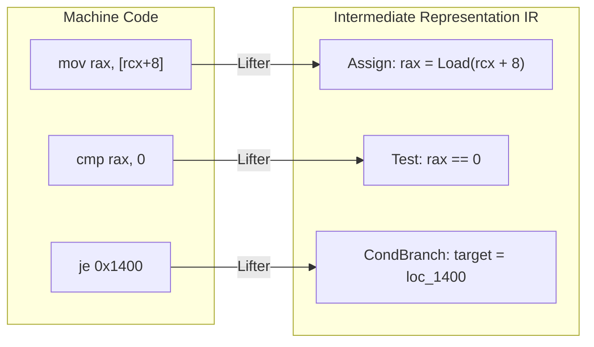
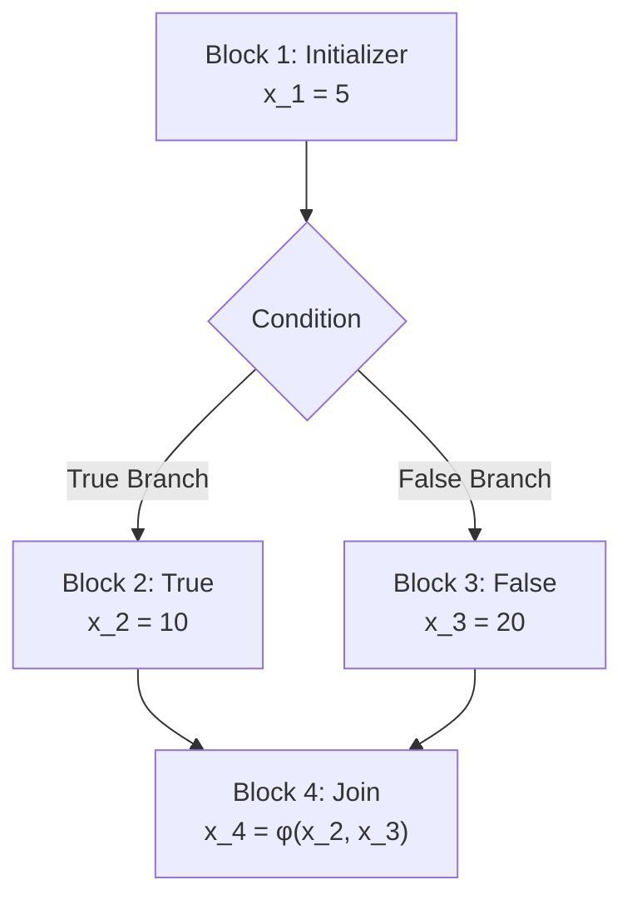
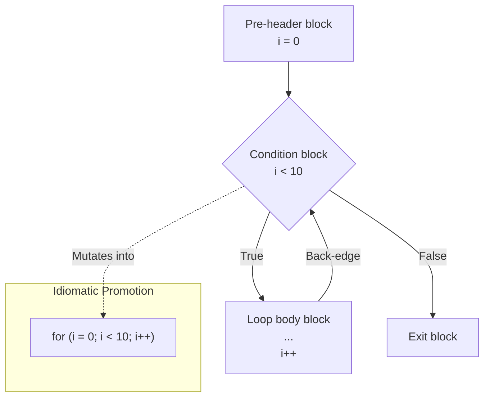

  

# EUVA Decompiler Overview

This document outlines the theoretical foundation, core principles, and architectural design of the EUVA Decompiler. The objective of this engine is to extrapolate high-level, idiomatic semantic representations from discrete machine-level instruction sets.

## 1. Architectural Principles

The EUVA decompiler implements a multi-stage, pipeline-driven architecture. Operations are strictly sequential, with each phase applying successive abstractions over the incoming intermediate representation IR.

### 1.1 Instruction Lifting (IR Translation)
Due to the vast permutation and implicit side-effects of hardware ISAs e.g., x86/x64 flags, complex addressing, direct analysis is intractable. The **IR Lifter** serves to normalize CPU opcodes into bounded, explicit intermediate commands `Assign`, `Add`, `Call`, `Load`, `Store`. This isolation guarantees that subsequent data-flow algorithms remain hardware-agnostic.



### 1.2 Static Single Assignment (SSA)
To achieve precise data-flow traversal, the decompiler relies on **Static Single Assignment (SSA) form**. In SSA, each target destination is assigned exactly once. Recurrent register usage e.g., `rax` is disambiguated via discrete versions `rax_1`, `rax_2`. 

Subsequent divergence in control flow e.g., branching inherently requires variables to merge paths. This is reconciled via the insertion of **Phi ($\phi$) nodes**, which conditionally select the correct SSA version based on the incoming execution block. SSA enforces a traceable def-use chain required for rigorous optimizations.



### 1.3 Data-Flow Optimization Algorithms
Directly translated assembly code exhibits extreme redundancy due to stack constraints and calling conventions. A repetitive optimization loop (cascading passes) is employed to reduce entropy:
* **Copy Propagation:** Identifies contiguous, non-mutating register assignments and structurally collapses them. e.g., `a = b; c = a;` resolves structurally to `c = b;`.
* **Dead Store Elimination (DSE):** Executes reverse-sweeps of basic blocks to locate and excise volatile memory writes `[base+disp]` that are immediately overwritten without an intervening read operation.
* **Expression Simplifier & Constant Propagation:** Extrapolates algebraic determinism and collapses variables backed by static immediate values.

### 1.4 Abstract Syntax Tree (AST) Expression Folding
Flat IR lists are structurally incompatible with high-level languages like C++. **AST Expression Folding** employs a forward scanning heuristic utilizing SSA `UseCount` properties. Temporary registers possessing an explicit `UseCount == 1` are directly embedded into their destination consumer nodes. Through recursive application within the optimizer pipeline, cascading atomic assignments transform into deeply nested mathematical expressions.

```c
// Before Folding Flat IR / Assembly Equivalent
tmp_1 = t2 >> 11;
tmp_2 = tmp_1 * a2;
t2 = t2 - tmp_2;

// After AST Expression Folding Single Assignment
t2 -= (t2 >> 11) * a2;
```

### 1.5 Control Flow Structuring
Disassembly produces a flat, node-based **Control Flow Graph (CFG)** driven by explicit jumps and conditionals. Structural recovery algorithms analyze dominance and back-edges to extrapolate deterministic C-style control structures.
* Post-dominance verification isolates logical enclosures for `If/Else` blocks.
* Back-edge detection within cyclic loops enables identifying definitive `While` operations. 
* AST Mutation heuristics analyze initialization constraints and step-increments inside `While` boundaries to structurally promote loops into idiomatic `For` nodes.



### 1.6 Advanced Type Inference and ABI Recovery
The semantic meaning of registers is inferred via an advanced, constraint-based **Type Inference Engine** operating on the SSA form, combined with calling convention modeling:
* **Rich Data Model:** SSA variables utilize a `TypeInfo` structure supporting base primitives `Int8` to `Int64`, `Float`, `Struct`, `Void` combined with recursive `PointerLevel` tracking, allowing accurate representation of complex types e.g., `unsigned char**`.
* **Worklist-based Constraint Solver:** A Queue-driven algorithm propagates seeded type constraints deduced from memory load/store instruction widths, exact pointer arithmetic, and WinAPI imports iteratively across the data-flow graph.
* **Phi Node Unification:** When execution paths merge inside $\phi$ nodes, the engine executes type unification, strictly favoring specifically typed pointers over ambiguous untyped memory `void*`.
* **ABI Parameter Resolution:** Dynamic mapping of `fastcall`/`cdecl` register states into standard sequential function invocations.
* **VTable Detection:** Heuristics recover dynamic polymorphism patterns, translating opaque indirect function pointers back into Object-Oriented context `this->method()`.

### 1.7 Pseudocode Emission
The terminal stage executes a forward traversal over the reconstructed AST elements. The **Pseudocode Emitter** formats nodes into strings conforming closely to idiomatic C++ semantics. The emission stage involves backward context scanning for translating native CPU flags into high-level boolean conditionals Condition Propagation, mapping arithmetic combinations to shorthand operators Compound Assignments, and isolating temporary SSA suffixes from final outputs.

---

## 2. Directory and Source File Mapping

The following catalog provides contextual indexing of the core EUVA repository mechanisms and their respective implementations.

### Engine Configuration & Execution
* [DecompilerEngine.cs](../EUVA.Core/Disassembly/DecompilerEngine.cs) - Main interface exposing asynchronous analysis requests and engine parameters.
* [DecompilationPipeline.cs](../EUVA.Core/Disassembly/Analysis/DecompilationPipeline.cs) - The orchestrator housing the sequential execution phases and cyclic optimization loops.

### Intermediate Representation Model
* [IrLifter.cs](../EUVA.Core/Disassembly/Analysis/IrLifter.cs) - Instruction decoder lifting `Iced.Intel` structures into IR models.
* [IrInstruction.cs](../EUVA.Core/Disassembly/Analysis/IrInstruction.cs) - Base data model containing Opcodes, operand sources, and destination indices.
* [IrOperand.cs](../EUVA.Core/Disassembly/Analysis/IrOperand.cs) - Operational variables encompassing Immediate Constants, Registers, Stack Slots, and nested Expressions.

### Graph and Data-Flow Analyzers
* [SsaBuilder.cs](../EUVA.Core/Disassembly/Analysis/SsaBuilder.cs) - Implementation for executing Dominance Frontiers, variable def-use tracking, and dynamic Phi-node injection.
* [DeadCodeElimination.cs](../EUVA.Core/Disassembly/Analysis/DeadCodeElimination.cs) - Recursive UseCount tracker and reverse-block Dead Store Elimination execution.
* [ExpressionInliner.cs](../EUVA.Core/Disassembly/Analysis/ExpressionInliner.cs) - The primary engine executing the fusion of temporary IR elements into nested AST expressions.
* [CopyPropagation.cs](../EUVA.Core/Disassembly/Analysis/CopyPropagation.cs) - Algorithmic reduction of unneeded intermediate variable transitions.

### Control Flow Recovery
* [DominatorTree.cs](../EUVA.Core/Disassembly/Analysis/DominatorTree.cs) - Graph-theory implementation calculating domination dependencies across BasicBlocks.
* [ControlFlowStructurer.cs](../EUVA.Core/Disassembly/Analysis/ControlFlowStructurer.cs) - Core structured transformation routines isolating `If`, `While`, `For` loop patterns.
* [LoopDetector.cs](../EUVA.Core/Disassembly/Analysis/LoopDetector.cs) - Evaluates block back-edges for loop determination.

### Semantics & Emitted Output
* [PseudocodeEmitter.cs](../EUVA.Core/Disassembly/Analysis/PseudocodeEmitter.cs) - Transforms memory-resident structured ASTs into linear textual Pseudocode outputs with conditional context propagation.
* [CallingConventionAnalyzer.cs](../EUVA.Core/Disassembly/Analysis/CallingConventionAnalyzer.cs) - Maps processor state against functional calling paradigms targeting function signatures.
* [TypeInference.cs](../EUVA.Core/Disassembly/Analysis/TypeInference.cs) - Assigns explicit memory types via propagation analysis.
* [StructReconstructor.cs](../EUVA.Core/Disassembly/Analysis/StructReconstructor.cs) - Discovers structured memory offset patterns representing class/struct definitions.

### Presentation Layer
* [DecompilerTextView.cs](../EUVA.UI/Controls/Decompilation/DecompilerTextView.cs) - Windows Presentation Foundation logical view binding formatting strings with UI presentation layouts.
* [DecompilerGraphView.cs](../EUVA.UI/Controls/Decompilation/DecompilerGraphView.cs) - Renders mathematical execution graphs associated with structural components.
